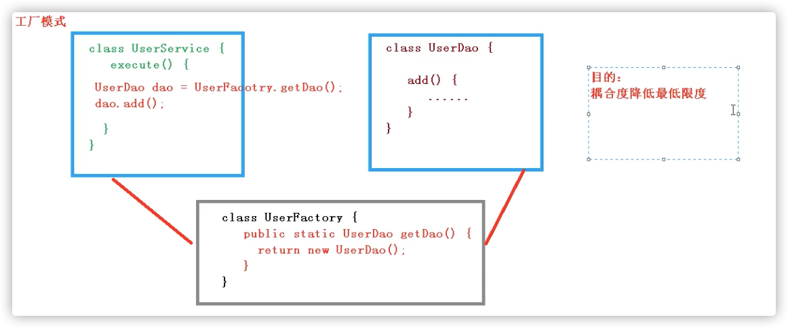

## Spring框架概述
***
1、Spring是轻量级的javaEE框架

2、Spring可以解决企业应用开发的复杂性

3、Spring有两个核心部分：IOC和AOP
（1）IOC：控制反转，把创建对象过程交给Spring进行管理
（2）AOP：面向切面，不修改源代码进行功能增强

4、Spring特点
（1）方便解耦，简化开发
（2）AOP编程支持
（3）方便程序测试
（4）方便和其他框架进行整合
（5）方便进行事务操作
（6）降低API开发难度

## IOC容器
* IOC底层原理
* IOC接口（BeanFactory）
* IOC操作Bean管理（基于xml）
* IOC操作Bean管理（基于注解）

### IOC概念和原理
* 控制反转：把对象创建和对象之间的调用过程，交给Spring进行管理
* 使用IOC的目的：为了降低耦合度

### IOC底层原理
* xml解析、工厂模式、反射

### 画图理解IOC底层原理

#### 原始方式
> 耦合度太高

#### 工厂模式
>目的：降低耦合度

#### IOC过程

### IOC（接口）
1. IOC思想基于IOC容器完成，IOC容器底层就是对象工厂
2. Spring提供IOC容器实现两种方式：（两个接口） 
    * BeanFactory:IOC容器基本实现，是Spring内部的使用接口，不提供给开发人员使用
      * 加载配置文件时不会创建对象，在获取对象（使用）才去创建对象
    * ApplicationContext:BeanFactory接口的子接口，提供更多更强大的功能，一般是开发人员进行使用
      * 加载配置文件时就会把配置文件中的进行创建
3. ApplicationContext接口实现类

## AOP 

## JdbcTemplate

## 事务管理